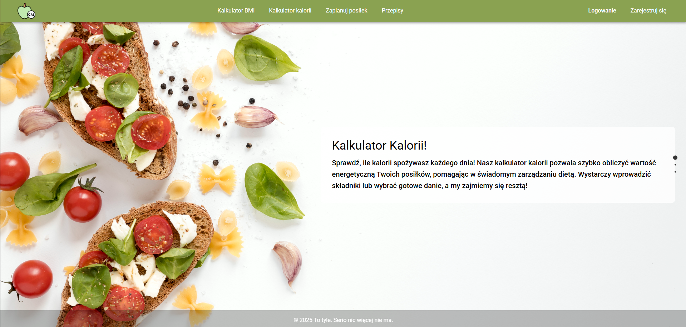

# Count Your Calories

## Współautorzy:
- Tomasz Mol - [tomaszmol](https://github.com/USERNAME)
- Bartosz Ludwin - [FalcO0O](https://github.com/FalcO0O)
- Dominik Kozimor - [Elemental-afk](https://github.com/Elemental-afk)


## Opis projektu

WDAI_Projekt to aplikacja internetowa stworzona w ramach zajęć z Wstępu do Aplikacji Internetowych. Aplikacja umożliwia użytkownikom zarządzanie posiłkami, w tym przeglądanie historii spożywanych posiłków, liczenie zapotrzebowania kalorycznego oraz BMI, przeglądanie przepisów.

## Funkcje

- **Rejestracja i logowanie użytkowników**: Użytkownicy mogą tworzyć konta oraz logować się do aplikacji.
- **Historia posiłków**: Przeglądanie historii spożywanych posiłków z podziałem na dni.
- **Panel administracyjny**: Dostęp dla administratorów do zarządzania użytkownikami i treściami. TODO

## Wymagania systemowe

- Node.js w wersji 14.x lub nowszej
- npm w wersji 6.x lub nowszej
- SQLite jako baza danych

## Instalacja

1. **Klonowanie repozytorium**

   ```bash
   git clone https://github.com/FalcO0O/WDAI_Projekt.git
   cd WDAI_Projekt
   ```

2. **Instalacja zależności**

   ```bash
   npm run install-all
   ```

3. **Uruchomienie aplikacji**

   ```bash
   npm run start-all
   ```

   Aplikacja będzie dostępna pod adresem `http://localhost:3000`.

   Nie mylic z `npm install` i `npm start`.
   W naszym podejsciu instalujemy wszystkie zależności za pomoca skryptów i jednocześnie uruchamiamy backend i frontend.

## Użycie

Po uruchomieniu aplikacji:

- **Rejestracja**: Utwórz nowe konto, podając wymagane dane.
- **Logowanie**: Zaloguj się, używając wcześniej utworzonych danych.
- **Historia posiłków**: Sprawdź historię spożywanych posiłków w odpowiedniej sekcji.
- **Panel administracyjny**: Jeśli jesteś administratorem, uzyskasz dostęp do panelu administracyjnego, gdzie możesz zarządzać użytkownikami i treściami.


## Wizualizacja

### Strona główna


### Przewijanie strony głównej
  


### Strona kalkulatora BMI


### Strona rejestracji


### Strona rejestracji - wprowadzone dane


### Strona rejestracji - rejestracja pomyślna


### Strona logowania


### Strona kalkulatora kalorii


### Strona kalkulatora kalorii - przeliczenie kalorii


### Strona "Zaplanuj posiłek"


### Strona "Zaplanuj posiłek" - wprowadzanie posiłku


### Strona "Zaplanuj posiłek" - zaktualizowany widok


### Strona "Zaplanuj posiłek" - zmiana daty


### Strona "Przepisy"


### Strona "Przepisy" - widok opisu przepisu


## Licencja

Ten projekt jest licencjonowany na podstawie licencji MIT. Szczegóły znajdują się w pliku [LICENSE](./LICENSE).
